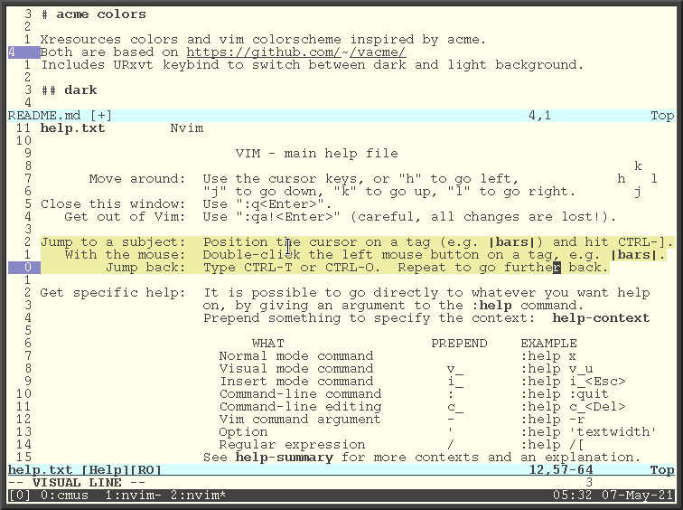

# acme colors

Xresources colors and vim colorscheme inspired by acme.
Both are based on https://github.com/olivertaylor/vacme/
Includes URxvt keybind to switch between dark and light background.

## dark

## light

